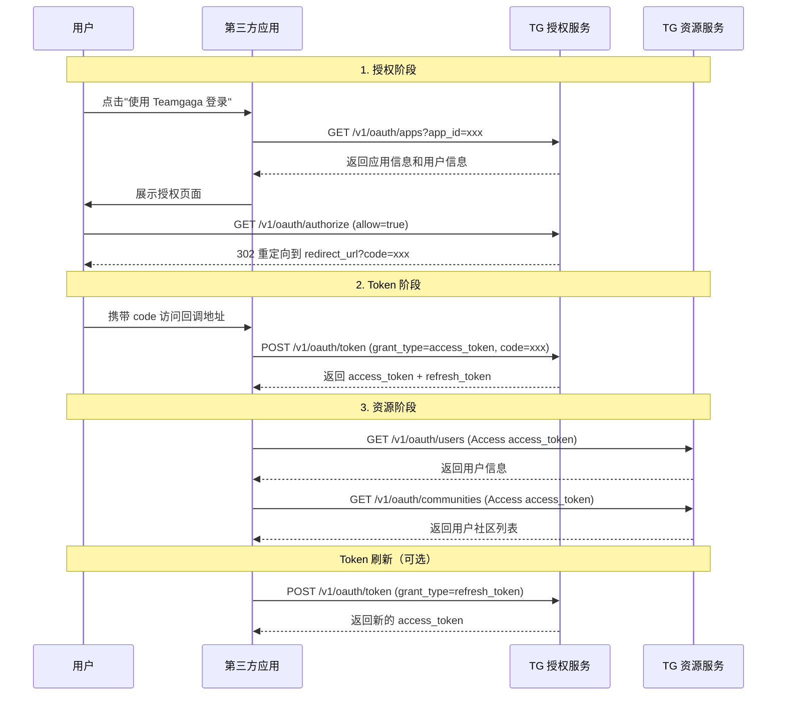

# OAuth API（第三方授权）

Teamgaga 开放平台使用 OAuth 2.0 授权码模式。第三方应用通过以下流程获取用户授权：

---

## Token 操作

**接口路径**
`POST /v1/oauth/token`

**请求参数**

| 参数名 | 位置 | 类型 | 必填 | 描述 |
|--------|------|------|------|------|
| Authorization | header | string | 是 | Oauth Token (base64(app_id:app_secret)) |

**Body**
[TokenReq](#TokenReq) 对象

**响应参数**

- **200**：返回 [TokenResp](#TokenResp) 对象

---

## 获取授权用户信息

**接口路径**
`GET /v1/oauth/users`

**请求参数**

| 参数名 | 位置 | 类型 | 必填 | 描述 |
|--------|------|------|------|------|
| Authorization | header | string | 是 | Access <access_token> |

**响应参数**

- **200**：返回 [ApiUserInfo](#ApiUserInfo) 对象

---

## 获取授权用户社区列表

**接口路径**
`GET /v1/oauth/communities`

**请求参数**

| 参数名 | 位置 | 类型 | 必填 | 描述 |
|--------|------|------|------|------|
| Authorization | header | string | 是 | Access <access_token> |

**响应参数**

- **200**：返回 [Community](#Community) 对象数组

---